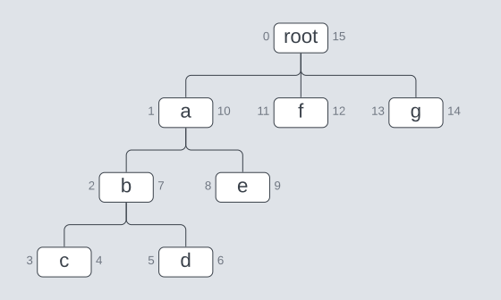

# StateChart

## Installation

This package can be installed by adding `modified_preorder_tree` to your list of dependencies in `mix.exs`:

```elixir
def deps do
  [
    {:modified_preorder_tree, "~> 0.1.1"}
  ]
end
```

## Concepts

<!--- StateChart moduledoc start -->



Numbers are assigned such that a path can be traced around the tree,
taking in every node.
The path here starts at `root`, flowing down the left,
around the bottom of the `b` subtree, then up to the `e` branch of `a`,
and from there to the other branches of `root`, before flowing back to `root`.

Leaf nodes (those with no children) have Left and Right values immediately after each other;
`f`, for example, is 11/12.
The parent of a node has a smaller Left and a bigger Right;
which can be used to trace up the tree finding parent nodes,
until you hit a Left of 0 (meaning the root node).

## `MPTree` API

- Constructors
  - `from_node/1`
- Reducers
  - `insert/3`
  - `insert!/3`
  - `update_nodes/2`
  - `update_nodes/3`
- Converters
  - `fetch_ancestors_and_self/2`
  - `fetch_ancestors_and_self!/2`
  - `fetch_children/2`
  - `fetch_children!/2`
  - `fetch_descendents/2`
  - `fetch_descendents!/2`
  - `fetch_family_tree/2`
  - `fetch_family_tree!/2`
  - `fetch_node/2`
  - `fetch_node!/2`
  - `fetch_parent/2`
  - `fetch_parent!/2`
  - `fetch_transition_path/3`
  - `fetch_transition_path!/3`
  - `nodes/1`

<!--- StateChart moduledoc end -->

